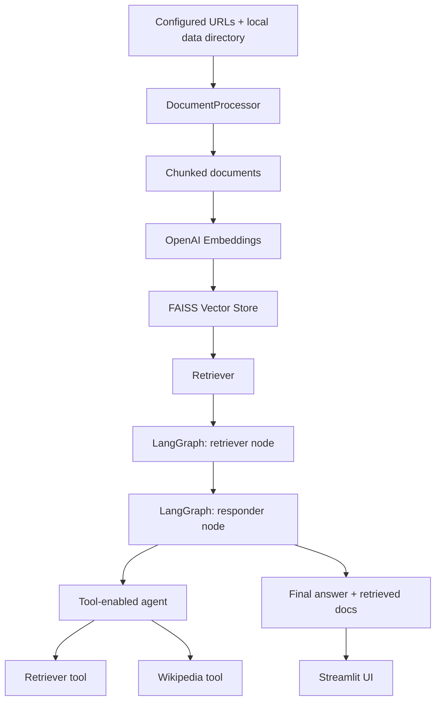

# AdRAGSearch

AdRAGSearch is a lightweight agentic RAG application for asking questions over a mixed knowledge base of web pages and local documents. The current MVP combines Streamlit for the user interface, LangChain for document processing and tool integration, FAISS for semantic retrieval, LangGraph for workflow orchestration, and OpenAI models for embeddings and answer generation.

This repository is a strong foundation for document Q&A assistants, internal knowledge search, research copilots, and retrieval-based AI product experiments.

## Overview

The app loads content from:

- configured web URLs
- local PDF files in the `data/` directory
- local `.txt` files through the ingestion layer when you add them as sources

That content is split into chunks, embedded with OpenAI embeddings, stored in a FAISS vector index, and queried through a LangGraph workflow. The answer generation step uses an agent that can choose between:

- a local retriever tool for indexed project documents
- a Wikipedia tool for broader public knowledge

The result is a simple but useful hybrid RAG experience: grounded answers from your indexed corpus, with the ability to reach beyond it when the question needs general context.

## Concepts Behind The Repo

### Retrieval-Augmented Generation (RAG)

RAG improves LLM answers by retrieving relevant source content first, then using that context during generation. In this repo, the retrieved context comes from a FAISS vector store built from your document corpus.

### Agentic RAG

This is not just a single prompt over retrieved documents. The answering step is tool-enabled. The model can decide whether to use:

- the internal retriever for indexed documents
- Wikipedia for general background knowledge

That makes the system more flexible than a basic retrieve-then-answer pipeline.

### Graph-Orchestrated Workflow

LangGraph is used to define the execution flow as explicit nodes:

1. retrieve relevant documents
2. generate the final answer

This makes the application easier to extend later with grading, query rewriting, routing, memory, or human-in-the-loop steps.

## Key Features

- Mixed-source ingestion from web URLs, PDF directories, single PDFs, and text files
- Recursive chunking for document preprocessing
- OpenAI embeddings with FAISS-backed semantic retrieval
- LangGraph-based orchestration for a clean RAG execution flow
- Tool-using answer generation with both retriever and Wikipedia access
- Streamlit UI with question input, answer display, source preview, and recent search history
- Cached system initialization to avoid rebuilding the full pipeline on every interaction

## Benefits

- Better grounded answers than plain chat because responses can use indexed source material
- More flexible than basic RAG because the answering agent can also use Wikipedia for general knowledge
- Easy to understand and demo because the architecture is small and the UI is simple
- Easy to extend into a more advanced AI product because ingestion, retrieval, state, graph, and UI are already separated into modules
- Useful as an MVP foundation for internal search assistants, document copilots, and research exploration tools

## How It Works



### Runtime Flow

1. `streamlit_app.py` initializes the system on first load.
2. `DocumentProcessor` loads configured URLs and the local `data/` directory.
3. Documents are split into chunks using `RecursiveCharacterTextSplitter`.
4. `VectorStore` embeds the chunks with `OpenAIEmbeddings` and stores them in FAISS.
5. `GraphBuilder` creates a two-step LangGraph workflow:
   - `retriever`
   - `responder`
6. The `responder` node builds a tool-using agent with:
   - a retriever tool over the FAISS index
   - a Wikipedia lookup tool
7. The Streamlit UI sends a user question into the graph and displays:
   - the final answer
   - previews of retrieved source chunks
   - recent search history

## UI Summary

The current UI is intentionally minimal and demo-friendly:

- A centered Streamlit page for quick question answering
- Automatic startup and document indexing on first load
- A single search box and submit button
- Answer output shown immediately after processing
- A source-document expander showing retrieved chunk previews
- A recent-search section showing the last few queries and answers

This makes the project easy to demo without introducing extra UI complexity.

## Default Data Sources

Out of the box, the app uses:

- two configured blog URLs in `src/config/config.py`
- the local `data/` directory as the default PDF source

The repository currently includes sample content such as:

- `data/Attentionisallyouneed.pdf`

To change the default knowledge base, update:

- `Config.DEFAULT_URLS`
- `Config.DEFAULT_PDF_DIR`

## Project Structure

```text
AdRAGSearch/
|-- streamlit_app.py                  # Main Streamlit app and UI flow
|-- main.py                           # Minimal placeholder entry point
|-- data/                             # Sample local documents
|-- src/
|   |-- config/config.py              # Model and source configuration
|   |-- document_ingestion/           # Source loading and chunking
|   |-- vectorstore/                  # Embeddings and FAISS retrieval
|   |-- state/rag_state.py            # Shared graph state
|   |-- nodes/reactnode.py            # Retrieval + agent answer nodes
|   |-- graph_builder/graph_builder.py # LangGraph workflow assembly
|-- pyproject.toml                    # Dependencies and package metadata
```

## Tech Stack

- Python 3.13+
- Streamlit
- LangChain
- LangGraph
- OpenAI API
- FAISS
- PyPDF / PyMuPDF
- BeautifulSoup / WebBaseLoader
- Wikipedia tool integration

## Setup

### 1. Clone The Repository

```bash
git clone <your-repo-url>
cd AdRAGSearch
```

### 2. Install Dependencies

This repository is currently set up around `uv`:

```bash
uv sync
```

### 3. Add Environment Variables

Create a `.env` file in the project root:

```env
OPENAI_API_KEY=your_openai_api_key
```

### 4. Run The App

```bash
streamlit run streamlit_app.py
```

Then open the local Streamlit URL in your browser.

## Configuration

Most important settings live in `src/config/config.py`:

- `LLM_MODEL` controls the chat model used for answer generation
- `CHUNK_SIZE` controls document chunk size
- `CHUNK_OVERLAP` controls overlap between chunks
- `DEFAULT_URLS` controls which web sources are indexed at startup
- `DEFAULT_PDF_DIR` controls which local directory is scanned for PDFs

## Example Use Cases

- Search across research papers and related web content
- Build a lightweight internal knowledge assistant
- Prototype agentic document Q&A workflows
- Demonstrate LangGraph plus Streamlit in a small end-to-end application
- Use as a starter repo for more advanced retrieval systems

## Current Scope And Limitations

. The current implementation is intentionally small and focused.

- The vector store is built at startup and kept in memory rather than persisted
- Source selection is configuration-driven, not user-upload driven
- The UI shows retrieved document chunks, but it does not separately expose Wikipedia tool traces
- There is no authentication, database, background job system, or observability layer
- There are no automated tests in the repo yet
-  `streamlit_app.py` is the primary entry point

## Why This Repo Is Useful

If you want to publish a clean GitHub project that demonstrates practical AI product building, this repo already shows several valuable ideas in a compact form:

- document ingestion from multiple source types
- semantic retrieval with embeddings and FAISS
- explicit workflow orchestration with LangGraph
- agent-style tool use layered on top of RAG
- a working UI that makes the system immediately demoable

That combination makes it a good showcase project for agentic AI, applied RAG, and end-to-end product prototyping.
